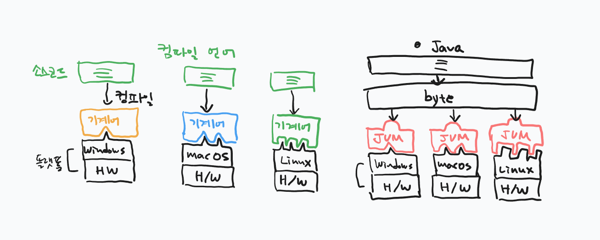

## 1교시: 복습

- 컴파일러 vs JVM

    

## 2교시: 상수

- Long integer의 경우 int의 범위를 넘어갈 때 끝에 L을 붙여야 한다.
- float의 경우 소수 타입의 기본형은 double이기 때문에, 끝에 F(f)를 붙여야 한다.
- 상수 (constant)
    - 한번 값이 저장되면 프로그램이 실행되는 동안 변경할 수 없는 데이터 저장소
    - Java에서는 변수 선언부 앞에 final 키워드를 붙여 사용
    - 상수 선언과 동시에 값 할당하지 않아도 된다. (선언과 할당이 따로여도 된다)
    - 상수의 이름은 관례적으로 모든 글자를 대문자로 작성, 단어와 단어 사이에 언더스코어(_)로 구분함
    - 상수를 사용하면 값의 의미가 명확해지고 코드의 안정성이 높아짐
    - 다만 final만 사용하면 클래스 단위에서 각 객체 생성시 객체마다 값을 다르게 가질 수 있으므로, 전역 상수를 만들거면 static final을 사용하여야 한다.
    - 생각해 볼 것: 과연 Java에서의 상수는 상수가 맞나?

      [생각: Java에는 왜 const(상수)가 없을까?](https://sslblog.tistory.com/23)

## 3교시: 리터럴, 식별자, 예약어, 형변환

- 리터럴 (literal)
    - 소스 코드 상에서 고정된 값 그 자체
    - 할당되는 데이터 값
    - 10, 3.14, ‘A’, “hello”, true 등
- 식별자 (identifier)
    - 변수, 상수, 메소드, 클래스 등 붙여주는 이름
    - 개발자가 임의로 지정할 수 있지만, 지켜야 할 문법적 규칙과 관례가 있음
- 식별자 명명 규칙
    - 영문 대소문자, 숫자, 밑줄, 달러 기호($)만 사용 가능
    - 숫자로 시작할 수 없음
    - 예약어(메소드, 타입 등)는 사용할 수 없음
    - 길이 제한은 없음
- 식별자 명명 관례(약속)
    - 클래스 이름: 대문자로 시작 (PascalCase)
    - 변수와 메소드 이름: 소문자로 시작, 단어가 바뀔 때 마다 대문자 사용 (camelCase)
    - 상수 이름: 모두 대문자 작성, 단어 사이는 밑줄로 연결 (SCREAMING_SNAKE_CASE)
- 예약어 (Keyword / Reverse Word)
    - 미리 약속되어 특별한 의미로 사용되는 언어
    - 식별자로 사용할 수  없음
    - int, class, public, if, for, true 등
- 형변환 (Type Casting)
    - 서로 다른 타입끼리 연산하거나 대입할 때 타입을 맞춰주는 작업
    - 자동 형변환
        - 작은 크기의 타입을 큰 크기의 타입으로 변환 (데이터 손실 X)
        - byte → short → int → long → float → double
    - 강제 형변환
        - 큰 크기의 타입을 작은 크기의 타입으로 강제 변환 (데이터 손실 위험)
        - 괄호 (타입)을 명시해야 함
        - 강제 형변환을 통한 오버플로우 구현 가능
    - boolean값은 정수(int)로 형변환 되지 않는다
        - Boolean 클래스 등으로 해결해야함

## 4교시: 연산자

- 산술 연산자
    - +, -, *, /, %(나머지)
        - +의 경우 문자열에 사용시 결합 연산자로서 사용됨
- 대입 연산자
    - =, +=, -=, *=, /=, %=
    - 우측 항목의 값을 계산한 후 왼쪽 항목에 대입
    - 산술 연산자와 혼용된 경우 왼쪽 값(변수)과 오른쪽 값을 계산하여 왼쪽 값에 대입한다
        - sum += 5 → sum = sum + 5
- 증감 연산자
    - ++, --
    - 값을 1 증가 혹은 감소
    - 변수 앞에 붙으면 연산 전 증감(전위 연산), 뒤에 붙으면 연산 후 증감(후위 연산)
- 비교 연산자
    - ==, !=, >, <, >=, <=
    - 두 항을 비교하여 참이면 true, 거짓이면 false을 반환
- 논리 연산자
    - && (AND): 두 항이 참이면 true, 그 외에는 falsew
    - ll (OR): 두 항 중 하나라도 참이면 true, 그 외에는 false
        - Java에서도 앞이 true면 뒤의 값이 존재하지 않아도 그냥 넘어간다.
    - ! (NOT): 참이면 false, 거짓이면 true
- 삼항 연산자
    - (조건식) ? (참 일 때 값) : (거짓 일 때 값)
    - 단일 조건 제어 흐름에 유용

## 5-6교시: 연산자 우선순위

- 연산자 우선순위

| 순위 | 연산자 유형 | 연산자 기호 | 연산 방향 |
| :--- | :--- | :--- | :--- |
| 1 | 괄호 및 대괄호 | (), [] | 왼쪽에서 오른쪽 |
| 2 | 단항 연산자 | ++, --, +, -, ! | 오른쪽에서 왼쪽 |
| 3 | 산술 연산자 (곱셈 계열) | *, /, % | 왼쪽에서 오른쪽 |
| 4 | 산술 연산자 (덧셈 계열) | +, - | 왼쪽에서 오른쪽 |
| 5 | 비교 연산자 (크기 비교) | <, <=, >, >= | 왼쪽에서 오른쪽 |
| 6 | 비교 연산자 (동등 비교) | ==, != | 왼쪽에서 오른쪽 |
| 7 | 논리 연산자 (AND) | && | 왼쪽에서 오른쪽 |
| 8 | 논리 연산자 (OR) | \|\| | 왼쪽에서 오른쪽 |
| 9 | 삼항 연산자 | ? : | 오른쪽에서 왼쪽 |
| 10 | 대입 연산자 | =, +=, -=, *=, /=, %= | 오른쪽에서 왼쪽 |
| 11 | 증감 연산자(후위형) | ++, -- | 2순위에 있지만 편의상 따로 표기 |
- 연산 방향(결합성)의 의미
    - 동일한 우선순위를 가진 연산자들이 여러 개 나열되어 있을 때, 컴파일러가 어느 쪽 연산자부터 먼저 해석하여 처리해 나갈지 결정한다.
    - 왼쪽에서 오른쪽 (Left-to-Right)
        - 대부분의 산술, 비교, 논리 연산이 해당, 일반적인 계산 순서와 같음
    - 오른쪽에서 왼쪽(Right-to-Left)
        - 대입, 단항 연산자 등이 이에 해당
        - 우측의 식부터 해석하여 좌측으로 누적 및 대입
- 연산 실무 가이드 및 권장 사항
    - 연산자 우선순위 규칙이 엄격히 존재하지만, 복잡한 수식은 가독성이 떨어지고 실수할 가능성이 늘어남
    - 조금이라도 연산 순서가 모호하거나 수식의 명확성을 높이고자 할 떄는 괄호 ’()’로 해당 연산을 감싸서 가독성을 확보