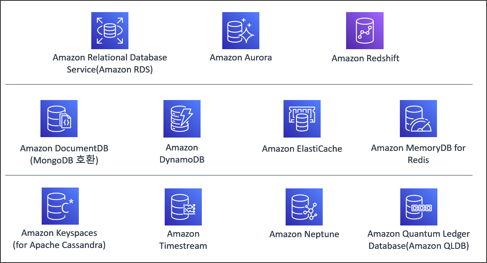
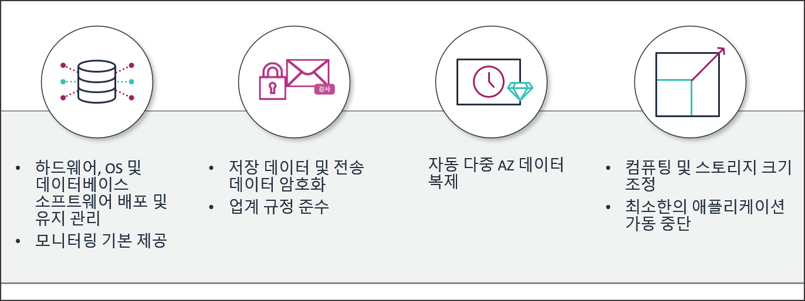
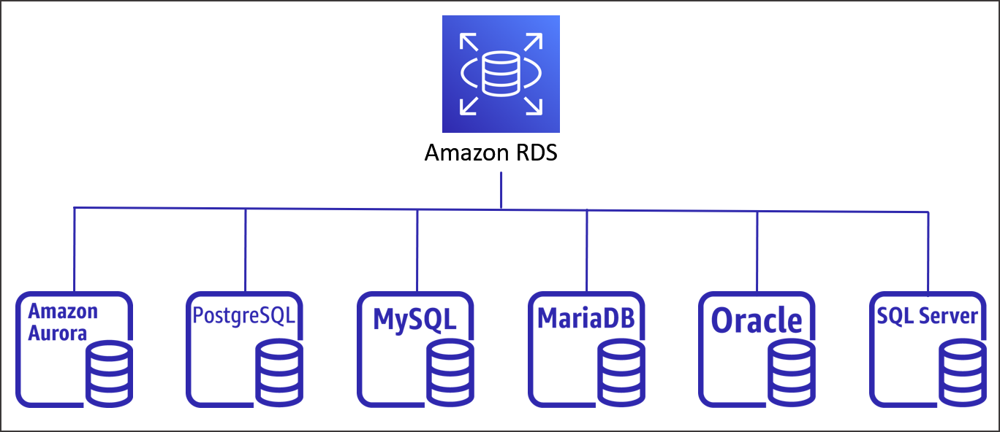
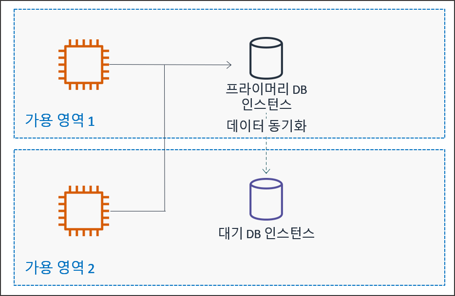
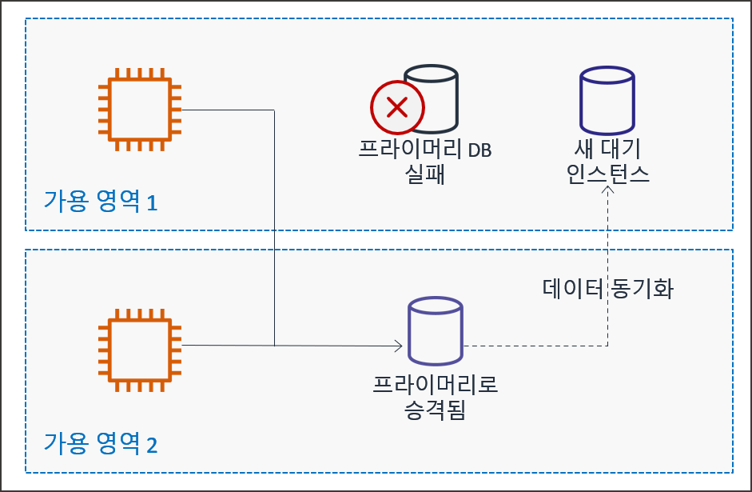
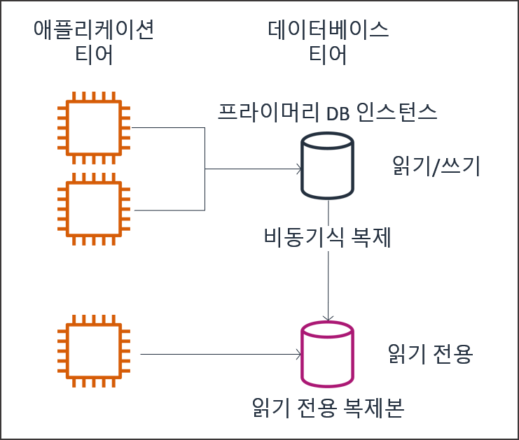

# EC2 기반 MySQL 데이터베이스 구축

## 1. MySQL 9.7 패키지 저장소 등록 및 설치

### 1.1 MySQL 외부 저장소 RPM (Red Hat Package Manager) 설치

- Amazon Linux 2023 기본 패키지 인덱스를 최신화하고 Official Enterprise Linux 9(ei9) 전용 MySQL 9.7 저장소 RPM 구성 패키지를 다운로드하여 시스템 패키지 매퍼에 등록

```bash
# 시스템 패키지 최신화
sudo yum update -y

# MySQL 9.7 Community Release RPM 다운로드 및 등록
sudo yum install -y https://dev.mysql.com/get/mysql97-community-release-el9-1.noarch.rpm

# Amazon Linux 2023 releasever 변수 치환 ($releasever -> 9) 및 캐시 삭제
sudo sed -i 's/$releasever/9/g' /etc/yum.repos.d/mysql-community*.repo
sudo yum clean all
```

### 1.2 MySQL 서버 패키지 설치

- 등록된 MySQL 공식 저장소를 통해서 MySQL Community Server 패키지 설치 진

```bash
# MySQL Server 패키지 설치
sudo yum install -y mysql-community-server
```

## 2. MySQL 서비스 데몬 활성화 및 초기 보안 설정

### 2.1 서비스 데몬 구동 및 자동 실행 등록

- systemd 체계를 통해 MySQL 서비스 데몬(Daemon)을 가동하고 OS 재부팅 시 자동 구동되도록 인에이블 처리

```bash
# MySQL 서비스 시작
sudo systemctl start mysqld

# 재부팅 시 자동 실행 설정
sudo systemctl enable mysqld

# 서비스 상태 확인
sudo systemctl status mysqld
```

### 2.2 초기 임시 비밀번호 확인 및 접속

- 서비스 구동 시 생성된 /var/log/mysqld.log 로그 파일에서 관리자(root) 초기 임시 비밀번호 검색 추출 후 접속

```bash
# 임시 비밀번호 확인
sudo grep 'temporary password' /var/log/mysqld.log

# root 계정으로 CLI 접속 (이후 나오는 비밀번호 입력 화면에서 위의 임시 비밀번호 입력)
mysql -u root -p
```

### 2.3 관리자 암호 변경 및 초기 보안 강화

- 복잡도 정책(대소문자, 숫자, 특수문자 포함 8자 이상)을 만족하는 보안 암호로 관리자 비밀번호 재설정

```sql
-- root 계정 비밀번호 변경
ALTER USER 'root'@'localhost' IDENTIFIED BY 'Root123!';
```

## 3. 데이터베이스 계정 생성 및 접근 권한 구성

### 3.1 애플리케이션 전용 데이터베이스 생성

- 게시판에서 사용할 데이터베이스 생성

```sql
-- 데이터베이스 생성
CREATE DATABASE board_db;
```

### 3.2 외부 접근 사용자 계정 생성 및 권한 부여

- 로컬 환경 및 외부 애플리케이션 서버에서 원격 접속 가능한 데이터베이스 사용자 계정을 정의하고 해당 데이터베이스 권한 부여

```sql
-- 외부 접속 권한 사용자 생성
CREATE USER 'board_app'@'%' IDENTIFIED BY 'Board123!';

-- board_db 데이터베이스에 대한 전권 부여
GRANT ALL PRIVILEGES ON board_db.* TO 'board_app'@'%';

-- 권한 변경 사항 적용
FLUSH PRIVILEGES;

-- MySQL 클라이언트 종료
EXIT;
```

## 4. 보안 그룹 규칙 구성 및 원격 접속 검증

### 4.1 EC2 보안 그룹 3306 포트 인바운드 허용

- AWS 관리 콘솔의 Security Group 설정으로 이동하여 MySQL 서비스 기본 포트인 3306번 TCP 트래픽을 허용하는 인바운드 방화벽 규칙 반영
    - AWS EC2 콘솔 > 인스턴스 > 대상 인스턴스 선택 > 하단 [보안] 탭 > 보안 그룹 선택
    - [인바운드 규칙 편집] 클릭 > [규칙 추가] 선택
    - 유형: MySQL/Aurora (3306)
    - 소스: 사용자 지정 (0.0.0.0/0 또는 접속을 허용할 IP 대역)
    - [규칙 저장] 클릭하여 설정 반영

### 4.2 Intellij IDEA 데이터베이스 툴 연동

- Intellij IDEA (Ultimate 구독을 하지 않을 경우 DBeaver 등의 외부 클라이언트 활용) Database 도구 창을 활용하여 EC2 퍼블릭 IP 및 3306 포트로 원격 접근 연결 상태 확인
    - IntelliJ 우측 탭의 [Database] 선택 > [+] (Add) 버튼 클릭 > [Data Source] > [MySQL] 선택
    - Host: `<EC2 퍼블릭 IP>`
    - Port: `3306`
    - User: `board_app`
    - Password: `Board123!`
    - Database: `board_db`
    - [Test Connection] 클릭하여 `Succeeded` 연동 상태 확인 후 [OK] 적용
    - 생성된 Data Source 우클릭 > [New] > [Query Console] 선택
    - 쿼리 콘솔 창에 SQL 구문 작성 후 [Ctrl + Enter]를 실행하여 데이터베이스 목록 조회 테스트

        ```sql
        SHOW DATABASES;
        ```


# AWS 데이터베이스 서비스 개요 및 유형 비교

## 1. SQL 및 NoSQL 데이터베이스 아키텍처 비교

### 1.1 관계형 데이터베이스 (SQL / RDBMS)

- 명확하게 정의된 스키마(Schema) 구조와 테이블 간의 관계(Relationship)를 바탕으로 데이터를 관리하는 방식
- 데이터의 엄격한 일관성과 무결성 보장을 위해 ACID(Atomicity, Consistency, Isolation, Durability) 트랜잭션 수용
- 금융 거래, 주문 처리, 회원 관리 등 복잡한 join 연산과 높은 데이터 정확도가 요구되는 시스템에 적합

### 1.2 비관계형 데이터베이스 (NoSQL)

- 유연한(Schema-less) 데이터 모델 구조를 지원하며, 수평적 스케일 아웃(Scale-Out) 확장에 최적화된 데이터베이스
- Key-Value, Document, Column-Family, Graph 등 다양한 데이터 저장 포맷 제공
- 실시간 소셜 미디어, 게임 세션, 대규모 IoT 로그 수집 등 초고속 쓰기 및 가변적 데이터 구조 처리에 적합



## 2. 관리형 데이터베이스와 비관리형 데이터베이스

### 2.1 EC2 직접 구축 DB (비관리형 모델)

- EC2 가상 머신 내에 데이터베이스 엔진(MySQL, PostgreSQL 등)을 직접 설치하요 운용하는 방식
- OS 설정부터 DB 커스터마이징까지 완전한 제어권을 보유하지만, 패치 적용, 백업 수립, 장애 복구, 고가용성 구성을 엔지니어가 직접 수행해야 함

### 2.2 Amazon RDS 관리형 서비스 (관리형 모델)

- 데이터베이스의 프로비저닝, OS 및 DB 패치 파일, 자동 백업, 백업 보존, 백업 복구, 백엄 덤프(Data Dump) 등을 AWS가 자동 처리해 주는 관리형 서비스
- 사용자는 데이터베이스 스키마 설계, 인덱스 최적화, SQL 쿼리 작성 등 순수 애플리케이션 개발 영역에 집중 가능

# Amazon Relational Database Service (Amazon RDS) 세부 아키텍처

## 1. Amazon RDS 핵심 기능 및 6대 데이터베이스 엔진

### 1.1 Amazon RDS 제공 기능

- 클라우드 환경에서 관계형 DB를 간편하게 설정, 운영 및 확장할 수 있도록 지원하는 인프라 서비스
- 용량 변경, 백업 자동화, 특정 시점 복구, 컴퓨팅 스케일링 기능 기본 내장



- 하드웨어, OS 및 DB 배포/유지 관리, 자동 모니터링 기본 제공
- 저장 데이터 및 전송 데이터 암호화를 통한 보안 및 업계 규정 준수
- 자동 다중 AZ 데이터 복제를 통한 고가용성 확보
- 컴퓨팅 및 스토리지 크기 조정 지원 및 최소한의 애플리케이션 가동 중단

### 1.2 Amazon RDS 지원 6대 DB 엔진



- Amazon Aurora (AWS 클라우드 전용 분산 DB 엔진)
- PostgreSQL (고성능 엔터프라이즈 오픈소스 DB)
- MySQL (오픈소스 관계형 DB)
- MariaDB (MySQL 파생 오픈소스 DB)
- Oracle Database (상용 엔터프라이즈 DB)
- Microsoft SQL Server (상용 관계형 DB)

## 2. Multi-AZ 고가용성 배포 및 자동 장애 조치

### 2.1 동기식 복제 (Synchronous Replication)



- 주 데이터베이스(Primary DB) 인스턴스가 위치한 가용 영역(AZ 1) 외에 다른 가용 영역(AZ 2)에 예비 DB(Standby DB) 인스턴스를 동시에 배치
- Primary DB에 쓰기 작업이 일어날 때마다 스토리지 계층에서 Standby DB로 데이터를 동기식으로 복제해서 데이터 동기화 유지

### 2.2 자동 장애 조치 (Failover)



- 가용 영역 1의 Primary DB 인스턴스에 장애 발생 시, 가용 영역 2의 Standby DB 인스턴스가 Primary DB로 자동 승격(Promote)되어 서비스 연결 유지
- 장애가 발생한 가용 영역 1 위치에는 새로운 대기 인스턴스를 자동으로 생성하고 데이터 동기화 복제 재개
- CNAME(Canonical Name) 기반의 동일한 엔드포인트 주소를 유지하면서 DNS 변경을 통해 트래픽을 대기 인스턴스로 자동 전환

## 3. 읽기 전용 복제본(Read Replica)을 통한 읽기 확장

### 3.1 비동기식 복제 (Asynchronous Replication)



- 애플리케이션 티어에서 쓰기 및 읽기 요청을 Primary DB 인스턴스로 처리하며, 트랜잭션 로그 기반의 비동기식 복제(Asychronous Replication)를 수행
- 주 DB의 트랜잭션 로그를 읽어와 읽기 전용 복제본(Read Replica) 인스턴스로 비동기식 전송 처리
- 읽기 트래픽(SELECT 쿼리)이 집중되는 웹 서비스에서 읽기 전용 엔드포인트를 별도로 분리하여 Primary DB의 연산 부하 경감

### 3.2 수평적 스케일 아웃 확장

- 동일 리전 내에 최대 15개까지 읽기 전용 복제본을 생성하여 읽기 처리 성능을 다중 확장 가능
- 필요시 읽기 전용 복제본을 독립된 승격(Promote) 인스턴스로 분리하여 별도 독자 DB로 운영 가능

## 4. DB 파라미터 그룹 및 옵션 그룹 설정

### 4.1 DB 파라미터 그룹 (Parameter Group)

- DB 엔진의 동작 세부 설정 변수(메모리 할당량, 최대 커넥션 수, 타임존, 문자 셋 인코딩 등)를 관리하는 파라미터 컨테이너
- 주요 필수 변경 파라미터
    - `time_zone`: Asia/Seoul (한국 표준시 KST 설정)
    - `character_set_server`: utf8mb4 (이모지를 포함한 다국어 유니코드 지원)
    - `collation_server`: utf8mb4_unicode_ci (문자열 정렬 및 비교 규칙)

### 4.2 파라미터 적용 방식의 구분

- 동적 파라미터 (Dynamic Parameter): 변경 즉시 DB 재부팅 없이 실시간 적용되는 변수
- 정적 파라미터 (Static Parameter): 변경 후 반드시 DB 인스턴스를 재부팅해야만 유효 적용되는 변수

## 5. RDS 백업, 스냅샷 및 특정 시점 복수 (PITR)

### 5.1 자동 백업 (Automatic Backup)

- 설정된 백업 윈도우 기간 동안 DB 전체 스토리지 상태 및 트랜잭션 로그를 Amazon S3에 자동으로 백업 보존
- 백업 보존 기간은 1일부터 최대 35일까지 지정 가능

### 5.2 수동 스냅샷 (Manual Snapshot)

- 사용자가 원하는 특정 시점에 직접 수동으로 생성하는 백업 이미지
- DB 인스턴스를 삭제하더라도 사용자가 명시적으로 삭제하기 전까지는 보존

### 5.3 특정 시점 복구 (Point-In-Time Recovery, PITR)

- 자동 백업과 트랜잭션 로그를 결합하여 보존 기간 내 사용자가 원라는 특정 초 단위 시점으로 DB 복원
- 복구 시 기존 DB를 덮어쓰지 않고 새로운 DB 엔드포인트를 가지는 신규 인스턴스로 복원 생성

## 6. 스토리지 타입 및 자동 확장 (Storage Auto Scaling)

### 6.1 gp2 vs gp3 스토리지 비교

- gp2: 용량(GB)에 비례하여 IOPS 성능 할당 (1GB당 3 IOPS)
- gp3: 차세대 범용 SSD로 용량 증가 없이 기본 3000 IOPS 및 125 MiB/s 처리량을 독자적으로 추가 지정 가능하여 비용 효율 우수

### 6.2 Storage Auto Scaling (스토리지 자동 확장)

- 잔여 저장 공간이 부족해지면 자동으로 스토리지를 증설하는 기능
- 예측하지 못한 데이터 폭증 시 스토리지 꽉 참(Storage Full) 장애를 선제 방지

# AWS 관리 콘솔 기반 RDS 인스턴스 환경 구성

## 1. DB 파라미터 그룹 생성 및 한글/타임존 설정

- AWS 콘솔 RDS 이동: AWS 관리 콘솔 접속 > [RDS] 서비스 이동
- 파라미터 그룹 메뉴 이동: 좌측 탐색 창에서 [파라미터 그룹] 선택 > [파라미터 그룹 생성] 클릭
- 파라미터 패밀리 지정:
    - 파라미터 그룹 패밀리: `mysql8.4` (또는 사용하는 DB 버전 패밀리)
    - 그룹 이름: `custom-mysql84-params`
    - 설명: `Timezone and UTF8mb4 settings`
- 파라미터 값 편집: 생성된 파라미터 그룹 선택 > [편집] 클릭
    - `time_zone` 필터링 > 값: `Asia/Seoul` 선택
    - `character_set` 관련 모든 항목 > 값: `utf8mb4` 변경
    - `collation` 관련 모든 항목 > 값: `utf8mb4_unicode_ci` 변경
- [변경 사항 저장] 클릭하여 파라미터 정의 완료

## 2. RDS DB 인스턴스 프로비저닝 및 기본 구성

- 데이터베이스 생성 시작: RDS 콘솔 > 좌측 [데이터베이스] 메뉴 > [데이터베이스 생성] 클릭
- 생성 방식 및 엔진 선택:
    - 데이터베이스 생성 방식: 표준 생성 (Standard Create)
    - 엔진 옵션: MySQL (또는 MariaDB)
    - 엔진 버전: MySQL 8.4 LTS
- 템플릿 선택: 프리 티어 (Free Tier) 또는 개발/테스트 선택
- 설정 (Settings):
    - DB 인스턴스 식별자: `board-db-rds`
    - 마스터 사용자 이름: `admin`
    - 마스터 암호 설정: `AdminPassword123!` (복잡도 만족 보안 비밀번호 입력)
- 인스턴스 구성 (Instance Configuration):
    - DB 인스턴스 클래스: 버스트 가능 클래스 > `db.t4g.micro` 선택
- 스토리지 (Storage):
    - 스토리지 타입: 범용 SSD (gp3)
    - 할당된 스토리지: `20` GiB
    - 스토리지 자동 설정: 체크 해제 (또는 최대 스토리지 임계값 100 GiB 지정)
- 연결성 (Connectivity):
    - 퍼블릭 액세스: 예 (Publicly Accessible)
    - VPC 보안 그룹: 기존 선택 또는 신규 보안 그룹 지정
- 추가 구성 (Additional Configuration):
    - 초기 데이터베이스 이름: `board_db`
    - DB 파라미터 그룹: 3.1 단계에서 생성한 `custom-mysql84-params` 선택
- [데이터베이스 생성] 클릭하여 백그라운드 프로비저닝 진행 (약 5~10분 소요)

## 3. DB 접속 엔드포인트 확인 및 초기 스키마 구성

- 엔드포인트 추출:
    - 데이터베이스 목록에서 `board-db-rds` 상태가 `상태: 사용 가능 (Available)`으로 변경된 것을 확인
    - 인스턴스 상세 탭 > [연결 및 보안] > 엔드포인트 (Endpoint) 주소 복사
    - 예시: `board-db-rds.xxxxxx.ap-northeast-2.rds.amazonaws.com`
- 애플리케이션 전용 사용자 계정 및 권한 생성:
    - 로컬 CLI 또는 데이터베이스 클라이언트를 통해 RDS 엔드포인트로 마스터 접속 수행

```sql
-- 마스터 계정으로 RDS 접속 후 전용 애플리케이션 계정 생성
CREATE USER 'board_app'@'%' IDENTIFIED BY 'Board123!';

-- board_db 데이터베이스에 대한 전권 부여
GRANT ALL PRIVILEGES ON board_db.* TO 'board_app'@'%';

-- 권한 변경 사항 저장 적용
FLUSH PRIVILEGES;
```