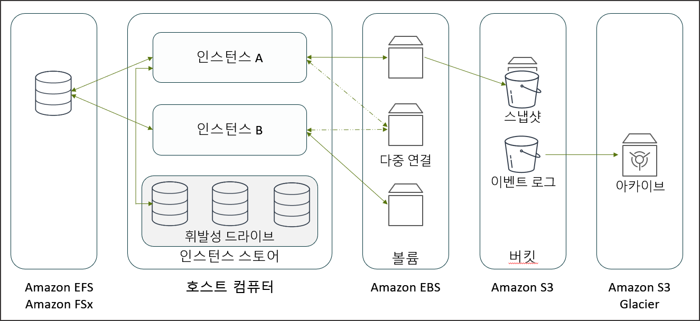
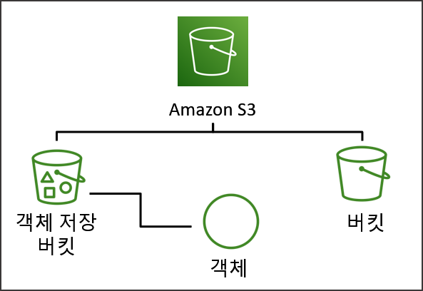
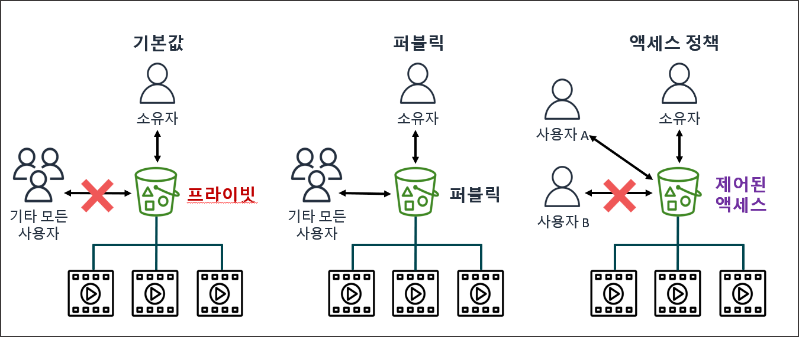
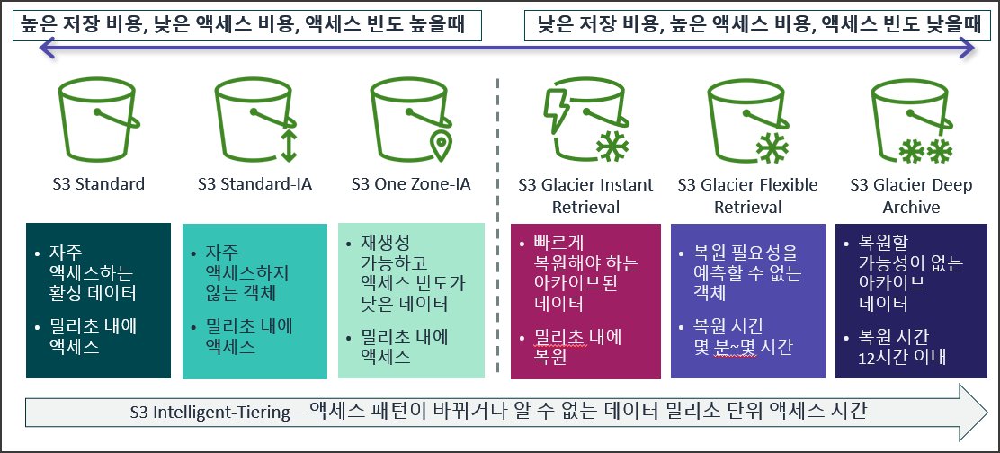
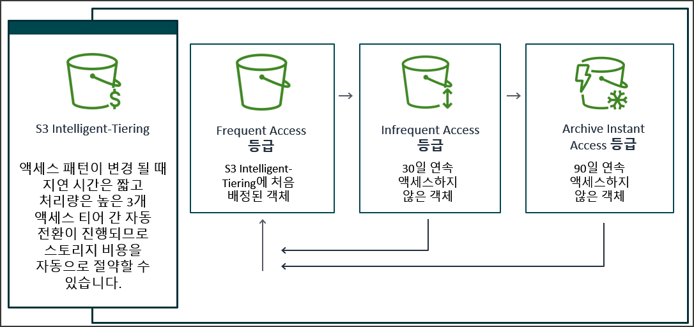
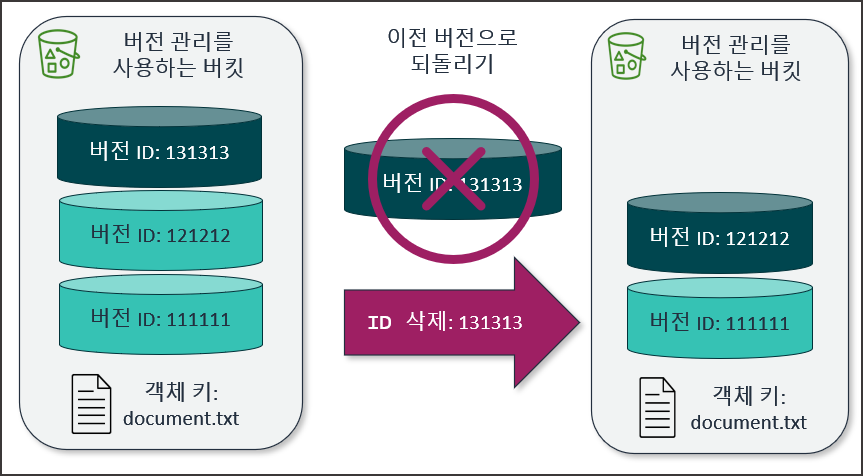

# 클라우드 스토리지 아키텍처 개요

## 1. 블록, 파일 객체 스토리지 특성

### 1.1 블록 스토리지 (Block Storage)

- 데이터를 고정된 크기의 블록(Block) 단위로 나누어 관리
- 전통적인 물리적 하드디스크 디바이스처럼 온프레미스 환경의 DAS(Direct Attached Storage) 또는 SAN(Storage Area Network)과 동일하게 기능 제공
- DB 같이 낮은 입출력 지연 시간과 고성능 무작위 읽기/쓰기가 필요한 엔터프라이즈 워크로드에 적합

### 1.2 파일 스토리지 (File Storage)

- 데이터가 디렉토리와 파일 계층 구조로 배치되는 전형적인 파일 시스템
- 네트워크 표준 프로토콜(NFS, SMB/SIFS)을 기반으로 작동하여 NAS(Network Attached Storage) 디바이스 환경과 동일하게 데이터 공유 지원
- 여러 가상 서버나 클라이언트 시스템이 동시에 동일한 파일 시스템에 접근하여 데이터 공유가 필요한 경우에 사용

### 1.3 객체 스토리지 (Object Storage)

- 데이터 본체(Data), 메타데이터, 고유 식별자(ID)를 묶어서 하나의 객체 단위로 저장하는 플랫(Flat) 주소 공간 환경 제공
- 파일 시스템의 계층적 디렉토리 구조 대신 고유한 객체 키(Object key)를 사용하며 REST API 기반으로 액세스 수행
- 무제한 확장성과 높은 내구성을 제공하며 정적 이미지, 동영상 미디어, 빅데이터 분석용 데이터 레이크, 아카이브 데이터 보관에 적합

## 2. AWS 스토리지 서비스 포트폴리오



### 2.1 블록 스토리지 기반 서비스

- Amazon Elastic Block Store (Amazon EBS): Amazon EC2 인스턴스 전용 고성능 영속적 블록 저장소
- EC2 Instance Store: EC2 물리적 호스트 서버에 직접 탑재된 초고속 임시 휘발성 블록 저장소

### 2.2 파일 스토리지 기반 서비스

- Amazon Elastic File System (Amazon EFS): 리눅스 EC2 인스턴스 간 다중 연결을 지원하는 서버리스 확장형 파일 시스템
- Amazon FSx: Windows File Server, Lustre, NetApp ONTAP, OpenZFS 등 특수 타깃 및 고성능 요구 사항에 맞춘 완전 관리형 파일 시스템

### 2.3 객체 스토리지 기반 서비스

- Amazon Simple Storage Service (Amazon S3): 인터넷 어디서나 데이터 수집 및 조회가 가능한 무제한 확장 스토리지

# Amazon Elastic Block Store (Amazon EBS)

## 1. EBS 볼륨 아키텍처 및 특징

### 1.1 EBS 기본 동작 원리

- Amazon EC2 인스턴스와 함께 사용하는 네트워크 연결 기반 영속적 블록 레벨 저장 디바이스
- 특정 가용 영역(AZ) 내에 배치되며 동일 가용 영역 안에서만 EC2 인스턴스에 연결 가능
- 가용 영역 내 수많은 디바이스에 자동으로 이중화 복제되어 데이터 손실 및 부품 결함 위험 최소화
- EC2 인스턴스를 종료하더라도 EBS 볼륨을 인스턴스와 분리하여 보존 가능하며, 필요한 시점에 스냅샷을 통한 Amazon S3 영구 백업 지원

### 1.2 EBS 볼륨 주요 제공 유형

- 범용 SSD (gp2, gp3): 비용과 성능의 균형을 제공하며 웹 서버, 개발 환경, 일반 업무용 DB에 범용 활용
- 프로비저닝된 IOPS SSD (io1, io2): 고성능 DB(Oracle, SQL Server, PostgreSQL)용으로 정밀한 IOPS 배정이 필요한 핵심 워크로드용 볼륨
- EBS Multi-Attach: Provisioned IOPS SSD 볼륨에 한해 동일 가용 영역 내 최대 16개의 EC2 인스턴스에 동식에 블록 볼륨 연결 가능

## 2. EC2 인스턴스 스토어와의 차이점

### 2.1 인스턴스 스토어 특징

- EC2 인스턴스가 실행되는 실제 물리 하드웨어 호스트 서버에 직접 탑재된 NVMe SSD 기반 드라이브
- 블록 IOPS 성능이 뛰어나고 지연 시간이 우수하지만 인스턴스 재부팅 시 데이터는 유지되나, 인스턴스 정지(Stop) 및 종료(Terminate) 시 드라이브 내부 데이터가 완전 삭제되는 휘발성 데이터 영역
- 임시 캐시 데이터, 메모리 버퍼, 분산 임시 로그 디렉토리에 한정하여 사용

# Amazon Simple Storage Service (Amazon S3)

## 1. Amazon S3 특징

- 데이터와 해당 데이터를 설명하는 메타데이터를 객체 단위로 저장하는 확장형 클라우드 객체 스토리지 서비스
- 개별 객체의 최대 크기는 5TB로 제한되나 전체 저장 가능한 객체 수와 버킷 전체 용량에는 제한이 없음

### 1.1 99.999999999% (11 nines) 데이터 내구성

- S3의 모든 기본 스토리지 클래스는 연중 99.999999999%(11 nines)의 높은 데이터 내구성을 보장하도록 설계
    - 만개의 파일를 천만년동안 저장했을 때 1개가 유실되는 수준
- 단일 리전 내 최소 3개 이상의 물리적 가용 영역(AZ)에 속한 독립된 데이터 센터 장비들에 데이터를 이중화 복제하여 저장
- 정기적인 패리티 체크 검증을 자동 수행하여 데이터 훼손시 자동으로 데이터 복수 진행

### 1.2 Amazon S3의 장점

- 신속한 혁신 추진: 별도의 물리적 파일 서버나 스토리지 인프라 구축 없이 API 호출만으로 즉시 정적 자원 저장소 운용
- 높은 민첩성: 데이터 증가에 따른 용량 증설 작업이나 디스크 튜닝이 불필요
- 비용 최적화: 데이터 액세스 빈도 및 보존 기간에 따라 다양한 스토리지 클래스를 선택하여 스토리지 요금 절감
- 강력한 보안 및 규정 준수: 기본으로 서버 측 암호화 적용, 퍼블릭 액세스 차단, PCI-DSS, HIPAA, FedRAMP 등 주요 준수 프로그램 충족

## 2. 버킷 및 객체 구조



### 2.1 버킷(Bucket) 네임스페이스 구성

- 글로벌 네임스페이스 (Global Namespace, 전통적 기본 방식)
    - 버킷 이름은 전 세계 모든 AWS 계정 및 모든 리전에 걸쳐 유일(Globally Unique)해야 함
    - 타 AWS 계정이 이미 선점한 버킷 이름은 중복 생성 불가
- 계정 리전 네임스페이스 (Access Regional Namespace, 신규 기능)
    - 버킷 이름 고유성 검증 범위가 본인 AWS 계정 및 지정한 특정 리전 내부로 한정
    - 타 계정의 버킷 이름 선점 여부와 관계없이 동일한 직관적 이름(예: logs, backups)을 내 계정/리전 범위에서 독립 사용 가능
- AWS 계정단 기본적으로 최대 100개까지 버킷 생성이 가능하며 신청을 통해 증설 가능

### 2.2 객체(Object) 및 객체 키(Object Key)

- S3 데이터 저장 기본 단위로 파일 데이터(Value)와 사용자 지정/시스템 메타데이터, 객체 키로 구성
- 객체 키는 버킷 내에서 특정 객체를 식별하기 위한 전체 경로 문자열
- 접두사(Prefix) 구분을 통해 마치 디렉토리 폴더 구조처럼 시각적 계층 표현 가능
    - 예: 2026-08-01/image.png

### 2.3 Amazon S3 URL 접근 지정

- S3 객체 웹 접근 URL 구조 요소 분해
    - URL 예시: `https://my-bucket.s3.ap-northeast-2.amazonaws.com/spring-board/logo.png`
    - 버킷 이름 (Bucket Name): `my-bucket`
    - 엔드포인트 도메인 (Endpoint): `s3.ap-northeast-2.amazonaws.com` (AWS 서울 리전의 s3 서비스 식별자)
    - 접두사 (Prefix): `spring-board/` (디렉터리 폴더 역할을 수행하는 경로 식별자)
    - 객체 키 (Object Key): `logo.png` (접두사를 포함한 버킷 내 유일 식별 경로)
- 가상 호스트 스타일 (Virtual-Hosted Style)
    - 버킷 이름이 서브 도메인에 위치하는 기본 권장 표준 규격 주소. (예: `https://my-bucket.s3.ap-northeast-2.amazonaws.com/spring-board/logo.png`)
- 정적 웹사이트 엔드포인트 세부 특징
    - S3 정적 웹사이트 호스팅 전용 엔드포인트는 HTTP 전송 프로토콜만 기본 지원하며 HTTPS 자체 암호화 적용 미지원.
    - HTTPS 보안 통신 및 커스텀 도메인 적용 시 Amazon CloudFront 엣지 서비스와의 연동 필요

## 3. Amazon S3 보안 및 액세스 제어

- Amazon S3의 모든 버킷과 객체는 생성 시 기본적으로 비공개(Private) 상태로 설정



### 3.1 버킷 정책 (Bucket Policy)

- S3 버킷 리소스에 직접 연결하는 JSON 기반 리소스 정책 문서
- 특정 IAM 사용자, 역할 또는 외부 AWS 계정에 대해 버킷 전체 또는 특정 객체 키 접두사에 대한 접근 허용/거부 설정

```json
{
    "Version": "2012-10-17",
    "Statement": [
        {
            "Effect": "Allow",
            "Principal": "*",
            "Action": [
                "s3:ListBucket",
                "s3:GetObject"
            ],
            "Resource": [
                "arn:aws:s3:::my-bucket",
                "arn:aws:s3:::my-bucket/*"
            ]
        }
    ]
}
```

- 버킷 정책 주요 구성 요소
    - Effect: 접근 행위에 대한 최종 허용(Allow) 또는 명시적 거부(Deny) 명세
    - Principal: 정책의 적용을 받는 접근 주체(AWS 계정 ID, IAM 사용자, IAM 역할 또는 전체 외부 개체 `*`) 지정
    - Action: 실행을 통제할 S3 서비스 API 조작 목록 지정
        - 예: `s3:ListBucket`, `s3:GetObject`, `s3:PutObject`, `s3:DeleteObject`
    - Resource: 정책이 적용되는 보안 대상 S3 리소스 ARN 식별자 지정
        - 버킷 자체 `arn:aws:s3:::my-bucket` 및 버킷 내 전체 객체 `arn:aws:s3:::my-bucket/*`
    - Condition (선택 사항): 정책 통제가 적용되기 위해 만족해야 하는 특정 세부 조건 규칙 지정
        - 특정 IP 대역 제한, SSL 전송 필수화 등

### 3.2 S3 퍼블릭 액세스 차단 (Block Public Access)

- 실수로 인한 고객 데이터 퍼블릭 노출을 방지하기 위한 강력한 중앙 안전 장치
- 계정 전체 수준 또는 개별 버킷 수준에서 적용 가능
- 4대 설정 항목
    - 새 ACL(Access Control List)을 통해 부여된 버킷/객체 액세스 차단
    - 모든 ACL을 통해 부여된 버킷/객체 액세스 차단
    - 새 퍼블릭 버킷 정책/액세스 포인트 정책을 통한 액세스 차단
    - 모든 퍼블릭 버킷/액세스 포인트 정책을 통한 교차 계정 액세스 무시

## 4. 서버 측 암호화 메커니즘

- Amazon S3는 2023년부터 모든 신규 생성 객체에 대해 서버 측 암호화(SSE)를 기본 적용

### **4.1 SSE-S3 (Amazon S3 관리형 키)**

- Amazon S3가 각 객체별 256비트 AES-256(Advanced Encryption Standard 256-bit) 키를 생성하여 데이터를 암호화하고 기본 마스터 키를 자동 관리.
- 별도의 키 관리 비용이나 설정 복잡성이 없는 기본 암호화 옵션.

### **4.2 SSE-KMS (AWS KMS 키)**

- AWS Key Management Service에 등록된 KMS 고객 마스터 키(CMK)를 사용하여 데이터 암호화 진행.
- 키 사용 권한 분리 및 AWS CloudTrail을 통한 암호화 키 접근 감사 로그 추적 가능.

### **4.3 SSE-C (고객 제공 키)**

- 클라이언트가 암호화 키의 생성을 직접 관리하고 HTTP 요청 헤더로 암호화 키를 S3에 전달하여 암호화/복호화만 S3에 위임 처리.
- S3는 클라이언트가 전달한 키를 디스크에 저장하지 않음

## 5. Amazon S3 스토리지 클래스 및 비용 최적화



| **스토리지 클래스** | **접근 지연 시간** | **최소 보존 기간** | **가용 영역** | **데이터 내구성** | **주요 용도** |
| --- | --- | --- | --- | --- | --- |
| S3 Standard | 밀리초 (ms) | 없음 | 3개 이상 | 99.999999999% | 자주 액세스하는 핫 데이터 |
| S3 Standard-IA | 밀리초 (ms) | 30일 | 3개 이상 | 99.999999999% | 액세스 빈도는 낮으나 빠른 인출 필요시 |
| S3 One Zone-IA | 밀리초 (ms) | 30일 | 1개 AZ | 99.999999999% | 재가공 가능하거나 단일 AZ 보관 허용 시 |
| S3 Glacier Instant Retrieval | 밀리초 (ms) | 90일 | 3개 이상 | 99.999999999% | 수 분에 한 번 조회되나 빠른 복구 필수 아카이브 |
| S3 Glacier Flexible Retrieval | 1분 ~ 12시간 | 90일 | 3개 이상 | 99.999999999% | 백업 데이터 및 표준 아카이빙 |
| S3 Glacier Deep Archive | 12시간 ~ 48시간 | 180일 | 3개 이상 | 99.999999999% | 수년 간 장기 보관하는 규정 준수 아카이브 |
| S3 Intelligent-Tiering | 밀리초 (ms) | 없음 | 3개 이상 | 99.999999999% | 접근 패턴을 예측하기 힘든 가변적 데이터 |

## 6. Amazon S3 Intelligent-Tiering



### 6.1 Intelligent-Tiering 동작 모드

- 데이터 액세스 패턴 변화에 맞춰 성능 저하나 운영 개입 없이 최선의 스토리지 비용 절감을 자동 수행
- 객체가 할당되면 기본 Frequent Access 계층에 배치되며, 30일간 접근이 없으면 Infrequent Access 계층으로 이동하고, 90일 연속 접근이 없으면 Archive Instant Access 계층으로 자동 이동
- 객체에 다시 액세스가 발생하면 자동으로 Frequent Access 계층으로 즉시 원복

## 7. 객체 버전 관리 및 객체 잠금

### 7.1 S3 버전 관리 (Versioning)

- 동일한 버킷 안에서 하나의 객체 키에 대해 여러 수정 버전을 유지하고 관리하는 기능
- 객체를 삭제하는 요청 발생 시 실제 파일 데이터를 삭제하는 대신 삭제 마커(Delete Marker)를 덮어씌워 실수 삭제 복원 기능 제공
- 덮어쓰기 발생 시 기존 버전은 이전 버전 ID로 보존되며 새로운 버전 ID 생성



### 7.2 S3 객체 잠금 (S3 Object Lock)

- 버전 관리가 활성화된 버킷에서 객체의 삭제나 덮어쓰기를 지정된 기간 동안 또는 영구히 차단하는 WORM 규정 정책

## 8. 수명 주기 정책

### 8.1 수명 주기 정책 (Lifecycle Policy) 개념

- 버킷 내부 객체의 수명 기간을 기준으로 스토리지 클래스 전환(Transition) 및 자동 삭제(Expiration)를 자동화하는 규칙

### 8.2 폭포형 전환 모델 (WaterFall Model)

- 객체 생성 후 30일 경과 시 S3 Standard-IA로 전환, 90일 경과 시 S3 Glacier Flexible Retrieval로 전환, 365일 경과 시 객체 완전 만료 삭제 처리 등의 자동 순환 주기 설계

# **리눅스 패킷 포워딩 및 포트 재전송 (iptables)**

## **1. iptables 방화벽 서비스 설치 및 데몬 활성화**

- 커널 패킷 필터링 조종용 iptables 설치 및 데몬 활성화

```bash
# iptables 서비스 설치
sudo yum install -y iptables-services

# 서비스 활성화 및 시작
sudo systemctl enable iptables
sudo systemctl start iptables
```

## **2. 80번 HTTP 포트를 8080번 애플리케이션 포트로 리다이렉트**

- 80번 웹 포트 접근 트래픽을 8080번 애플리케이션 포트로 리다이렉트 지정 및 설정 저장

```bash
# 1. 80 포트로 들어온 요청을 8080으로 리다이렉트 (PREROUTING)
sudo iptables -t nat -A PREROUTING -p tcp --dport 80 -j REDIRECT --to-port 8080

# 2. 로컬(localhost)에서 80으로 요청할 경우를 위한 설정 (OUTPUT)
sudo iptables -t nat -A OUTPUT -p tcp --dport 80 -o lo -j REDIRECT --to-port 8080

# 3. 8080 포트 인바운드 허용 규칙을 REJECT 앞에(5번) 추가
sudo iptables -I INPUT 5 -p tcp --dport 8080 -j ACCEPT

# 4. 설정 저장
sudo service iptables save
```

## **3. 방화벽 체인 및 NAT 리다이렉트 설정 규칙 검증**

- 등록된 패킷 필터링 및 NAT 포워딩 규칙 검증

### **3.1 패킷 필터링 규칙 확인**

```bash
sudo iptables -L -n -v
```

- 정상 등록 시 패킷 필터링 테이블 출력 예시:

```bash
Chain INPUT (policy ACCEPT 0 packets, 0 bytes)
 pkts bytes target     prot opt in     out     source               destination
 4530  471K ACCEPT     all  --  *      *       0.0.0.0/0            0.0.0.0/0            state RELATED,ESTABLISHED
    0     0 ACCEPT     icmp --  *      *       0.0.0.0/0            0.0.0.0/0
    3   180 ACCEPT     all  --  lo     *       0.0.0.0/0            0.0.0.0/0
   30  1588 ACCEPT     tcp  --  *      *       0.0.0.0/0            0.0.0.0/0            state NEW tcp dpt:22
   38  1908 ACCEPT     tcp  --  *      *       0.0.0.0/0            0.0.0.0/0            tcp dpt:8080
  115  6164 REJECT     all  --  *      *       0.0.0.0/0            0.0.0.0/0            reject-with icmp-host-prohibited

Chain FORWARD (policy ACCEPT 0 packets, 0 bytes)
 pkts bytes target     prot opt in     out     source               destination
    0     0 REJECT     all  --  *      *       0.0.0.0/0            0.0.0.0/0            reject-with icmp-host-prohibited

Chain OUTPUT (policy ACCEPT 4388 packets, 435K bytes)
 pkts bytes target     prot opt in     out     source               destination
```

### **3.2 필터링 규칙 삭제**

- 패킷 필터링 설정 오류 발생 시 규칙 삭제 후 재등록

```bash
sudo iptables -D INPUT -p tcp --dport 8080 -j ACCEPT
```

### **3.3 NAT 테이블 규칙 확인**

```bash
sudo iptables -t nat -L -n -v
```

- 정상 등록 시 NAT 테이블 체인 출력 예시:

```bash
Chain PREROUTING (policy ACCEPT 0 packets, 0 bytes)
 pkts bytes target     prot opt in     out     source               destination
    0     0 REDIRECT   tcp  --  *      *       0.0.0.0/0            0.0.0.0/0            tcp dpt:80 redir ports 8080

Chain INPUT (policy ACCEPT 0 packets, 0 bytes)
 pkts bytes target     prot opt in     out     source               destination

Chain OUTPUT (policy ACCEPT 0 packets, 0 bytes)
 pkts bytes target     prot opt in     out     source               destination
    0     0 REDIRECT   tcp  --  *      lo      0.0.0.0/0            0.0.0.0/0            tcp dpt:80 redir ports 8080

Chain POSTROUTING (policy ACCEPT 0 packets, 0 bytes)
 pkts bytes target     prot opt in     out     source               destination
```

### **3.4 NAT 포워딩 규칙 초기화**

- NAT 포워딩 설정 오류 발생 시 규칙 전체 초기화 후 재등록

```bash
# NAT 테이블 규칙 전체 초기화
sudo iptables -t nat -F
```

## **4. 보안 그룹 8080번 포트 인바운드 규칙 제거**

- 80번 포트 리다이렉트 포워딩 설정 적용 후, 8080 포트 외부 직접 노출을 차단하기 위해 EC2 보안 그룹 인바운드 규칙 제거
- 보안 그룹 콘솔로 이동
    - AWS EC2 > 인스턴스 > 생성한 인스턴스의 체크박스 선택 > 하단 [보안] 탭의 보안 그룹항목 sg-xxx 클릭
- 인바운드 방화벽 규칙 편집
    - 하단 [인바운드 규칙] 탭 선택 > [인바운드 규칙 편집] 버튼 클릭
    - 포트 범위가 8080인 규칙 항목 우측의 [삭제] 버튼 클릭
    - 우측 하단 [규칙 저장] 버튼 클릭하여 방화벽 설정 적용