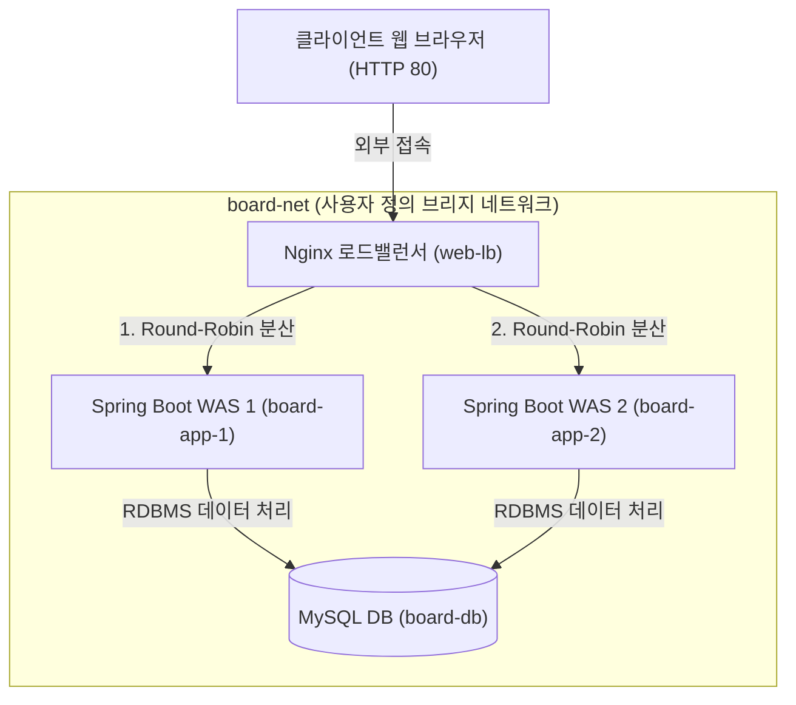
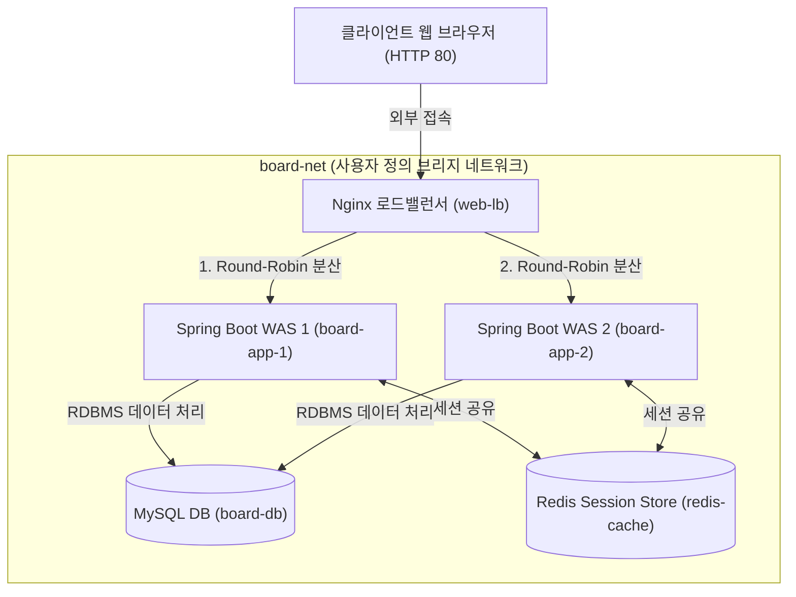

## **6. 구성 파일 및 비밀 정보 관리 (`configs` / `secrets`)**

- 최상위 `configs:` 및 `secrets:` 블록을 통해 외부 구성 파일이나 암호화된 민감 보안 키 정보를 컨테이너에 파일 형태로 안전하게 제공함.
- 일반 복사(`COPY`, `volumes`)와의 차이점
    - 이미지 재빌드 방지 (`COPY` 대비): 설정 파일 수정 시 이미지를 매번 새로 빌드해야 하는 `COPY` 방식과 달리, 컨테이너 구동 시점에 설정 파일을 동적 주입하므로 단일 이미지를 재사용할 수 있음.
    - 읽기 전용(Read-Only) 정합성 보장 (`volumes` 대비): 컨테이너 내부 프로세스가 설정 파일을 임의로 수정하거나 훼손할 수 없도록 완벽히 읽기 전용으로 보호함.
    - 보안 강화 (`secrets` 전용): 비밀번호나 보안 키를 디스크 저장이나 환경 변수로 노출하지 않고, 컨테이너 구동 시 인메모리(RAM) 임시 파일시스템(`tmpfs`, `/run/secrets/`)에 읽기 전용으로만 전달함. `docker inspect`나 `printenv` 검사 시에도 평문 비밀번호가 전혀 노출되지 않으며, 컨테이너 정지 시 메모리 상의 데이터가 완전 소멸함.
- `configs` 및 `secrets` 주입 파일의 프레임워크별 연동 메커니즘
    - Nginx 연동: 기본 설정 경로인 `/etc/nginx/nginx.conf` 위치로 `target`을 마운트하여 Nginx 데몬 시작 시 라우팅 설정을 자동 적용함.
    - MySQL 연동 (my.cnf & secrets): DB 서버 타임존과 캐릭터셋 등의 커스텀 설정은 `/etc/mysql/conf.d/` 디렉터리 하위의 `.cnf` 파일로 마운트하고, 비밀번호는 `MYSQL_PASSWORD_FILE` 또는 `MYSQL_ROOT_PASSWORD_FILE` 환경 변수에 `/run/secrets/db-password` 인메모리 절대 경로를 지정하여 부팅 시 읽어 들이도록 연동함.
    - Spring Boot 연동 (configtree & secrets): Spring Boot 2.4 이상에서는 외부 주입 설정 파일(`application.yml`) 내에 `spring.config.import: "configtree:/run/secrets/"` 지시어를 지정하여 `/run/secrets/` 디렉터리 하위의 시크릿 파일들을 자동 파싱함. 스캔된 파일명은 프로퍼티 키로, 파일 내용은 프로퍼티 값으로 매핑되어 `password: "${db-password}"` 형태로 보안 키를 동적 참조함.
- app.yml

    ```yaml
    # Docker Compose 런타임 외부 주입 전용 설정 (도커 환경 DB 접속 및 시크릿 덮어쓰기)
    spring:
      config:
        # 도커 시크릿 마운트 디렉터리(/run/secrets/) 내의 파일들을 스캔하여
        # 파일명을 프로퍼티 키로, 파일 내용을 프로퍼티 값으로 자동 매핑하는 설정
        import: "configtree:/run/secrets/"
      datasource:
        url: jdbc:mysql://board-db:3306/board_db
        username: board-app
        # configtree에 의해 /run/secrets/db-password 파일 내용이 동적으로 할당되는 프로퍼티 참조
        password: "${db-password}"
      sql:
        init:
          mode: always# 컨테이너 구동 시 DB 초기화 스크립트 실행 설정
    ```

- my.cnf

    ```
    [mysqld]
    # 글로벌 서버 표준 타임존 설정 (DB는 UTC 저장, 클라이언트에서 현지 시간 변환)
    default-time-zone = '+00:00'
    # 다국어 및 이모지(Emoji) 지원을 위한 UTF-8 4바이트 기본 캐릭터셋 지정
    character-set-server = utf8mb4
    # 문자열 비교/정렬 규칙 지정 (유니코드 UCA 정렬 + _ci: WHERE절 조건 조회 시 대소문자 구분 안 함)
    collation-server = utf8mb4_unicode_ci
    # SHA-1 이중 해시 기반 비밀번호 인증 방식 지정 (RSA 키 교환 과정 없으므로 JDBC URL의 allowPublicKeyRetrieval=true 파라미터 삭제 가능)
    default_authentication_plugin = mysql_native_password
    ```

- user_password.txt

    ```
    Board123!
    ```

- .gitignore에 docker/secrets 폴더 추가

    ```
    docker/secrets
    ...
    ```

- 작성 예시

    ```yaml
    # 1. 외부 구성 파일 및 비밀 정보 주입 정의
    configs:
      app-config:
        file: ./docker/configs/app.yml
      db-config:
        file: ./docker/configs/my.cnf
    
    secrets:
      db-password:
        file: ./docker/secrets/user_password.txt# 컨테이너 구동 시 user_password.txt의 내용으로 가상 파일시스템(RAM) 영역인 /run/secrets/db-password 로 읽기 전용 파일 마운트 됨
    
    # 1. 사용자 정의 브리지 네트워크 정의
    networks:
      board-net:
        name: board-net
        driver: bridge
    
    # 2. DB 데이터 영속화 전용 Named Volume 정의
    volumes:
      board-db-data:
        name: board-db-data
    
    # 3. 다중 컨테이너 서비스 명세
    services:
      # 게시판 웹 애플리케이션 서비스
      board-app:
        image: kilyong/spring-board:1.0
        container_name: board-app
        ports:
          - "80:8080" # 호스트 80 포트를 컨테이너 8080 포트에 포트 바인딩
        networks:
          - board-net
        configs:
          - source: app-config
            target: /app/config/application.yml# Spring Boot 1순위 최우선 자동 로드 마운트
        secrets:
          - db-password
        depends_on:
          board-db:
            condition: service_healthy# MySQL DB 헬스체크 통과(Healthy) 상태 판정 후 구동
        volumes:
          - ./uploads:/app/uploads# 호스트 첨부파일 디렉터리 바인드 마운트
          - ./logs:/app/logs# 호스트 시스템 로그 디렉터리 바인드 마운트
      #    restart: always
    
      # MySQL 데이터베이스 서비스
      board-db:
        image: mysql:9.7
        container_name: board-db
        ports:
          - "3306:3306" # 호스트 DB 접속 포트 바인딩 (외부 직접 접속 허용)
        networks:
          - board-net
        configs: # configs의 값은 배열이며 배열의 각 요소는 source, target 속성을 가지는 객체임
          - source: db-config
            target: /etc/mysql/conf.d/my.cnf# DB 커스텀 설정(my.cnf) 읽기 전용 마운트
        secrets:
          - db-password
        environment:
          MYSQL_DATABASE: board_db
          MYSQL_USER: board-app
          MYSQL_PASSWORD_FILE: /run/secrets/db-password
          MYSQL_ROOT_PASSWORD_FILE: /run/secrets/db-password
        healthcheck:
          test: ["CMD-SHELL", "mysqladmin ping -h localhost -u $MYSQL_USER -p$(cat /run/secrets/db-password) || exit 1"]
          interval: 3s # 3초 간격 헬스체크 검증
          timeout: 3s # 3초 응답 타임아웃
          retries: 10 # 최대 10회 재시도 실패 시 Unhealthy 판정
        volumes:
          - board-db-data:/var/lib/mysql# DB 데이터 영속성 보존용 Named Volume 마운트
    ```


# **Docker Compose CLI 운용 및 오케스트레이션 제어**

## **1. 서비스 제어 및 생성 파기**

### **1.1 서비스 일괄 생성을 위한 `up` 명령어**

- `docker compose up -d`: 설정 파일에 정의된 이미지를 빌드/다운로드하고, 네트워크 및 볼륨을 생성하여 전체 서비스를 백그라운드(데몬) 모드로 일괄 구동함.
- `docker compose up` 의 재생성(Recreate) 메커니즘
    - 기존 컨테이너를 삭제하고 다시 만드는 것이 아니라 선언적 상태를 비교함.
    - 설정 변경이 없으면 기존 컨테이너를 삭제하지 않고 유지하며, YAML 설정이나 이미지가 변경된 컨테이너만 선택적으로 정지/삭제 후 새로 재생성(Recreate)함.
    - `-force-recreate`: 설정 변경 여부와 관계없이 기존 컨테이너를 강제로 전면 삭제하고 새로 재생성하여 구동함.
- `docker compose up --build`: 서비스 하위에 `build:` 지시어(Dockerfile 컨텍스트 경로)가 정의되어 있는 서비스에만 적용되며, 로컬 이미지가 존재하더라도 Dockerfile 이미지를 강제로 새로 재빌드하여 구동함.

### **1.2 서비스 일괄 정제 및 파기를 위한 `down` 명령어**

- `docker compose down` 의 수명주기(Lifecycle) 기본 동작
    - 네트워크 자동 파기: 구동 중인 컨테이너와 브리지 네트워크는 항상 즉시 정지 및 삭제(Removed)함. 따라서 다시 `up` 할 때 네트워크는 매번 새로 생성(`Network ... Created`)됨.
    - 데이터 볼륨 안전 보존: DB 데이터 소실 방지를 위해 최상위 `volumes:` 의 Named Volume은 삭제하지 않고 호스트에 안전하게 보존(Preserved)함. 다시 `up` 구동 시 기존 볼륨을 그대로 재사용하여 데이터가 온전히 유지됨.
- `docker compose down -v` (또는 `-volumes`): 컨테이너와 네트워크뿐만 아니라 보존되던 데이터 볼륨까지 함께 정지 및 삭제함 (데이터가 삭제되므로 주의가 필요함).

### **1.3 서비스 일시 정지 및 재시작 (`stop`, `start`, `restart`)**

- `docker compose stop [서비스명]` / `docker compose start [서비스명]`: 생성된 컨테이너 삭제 없이 프로세스만 일시 중지하거나 재개함.
- `docker compose restart [서비스명]`: 전체 또는 지정한 서비스 컨테이너 프로세스를 재시작함.

### **1.4 명령어 기반 동적 스케일링 (`-scale`)**

- `docker compose up -d --scale [서비스명]=[수량]`: YAML 설정 파일 변경 없이 명령줄에서 동적으로 특정 서비스의 컨테이너 구동 개수를 확장(Scale-out)하거나 축소(Scale-in) 제어함.
- 예시: `docker compose up -d --scale board-app=3` 실행 시 `board-app` 컨테이너가 3대로 동적 확장되어 구동됨.

## **2. 서비스 상태 검증 및 로그 모니터링**

### **2.1 서비스 런타임 상태 및 헬스체크 검증 (`ps`)**

- `docker compose ps [서비스명]`: 해당 프로젝트에 속한 전체 또는 지정 컨테이너의 런타임 상태, 개방 포트 및 헬스체크 통과 여부를 조회함.
    - 참고: 기본적으로 명령어를 실행하는 현재 작업 디렉터리 이름을 프로젝트 이름으로 자동 인식함. 특정 프로젝트 이름을 직접 명시하여 제어하고 싶은 경우 `docker compose -p [프로젝트명] ps`와 같이 `p` (또는 `-project-name`) 플래그를 사용.

### **2.2 로그 실시간 스트리밍 모니터링 (`logs`)**

- `docker compose logs -f [서비스명]`: 전체 또는 지정한 특정 서비스의 출력 로그를 실시간으로 스트리밍 모니터링함.

### **2.3 컨테이너 프로세스 모니터링 (`top`)**

- `docker compose top`: 실행 중인 컨테이너 내부에서 동작 중인 호스트 프로세스 리스트를 확인함.

## **3. 컨테이너 내부 명령어 실행 및 리소스 정제**

### **3.1 대화형 쉘 및 명령어 실행 (`exec`)**

- `docker compose exec [서비스명] [명령어]`: 현재 구동 중인 지정 서비스 컨테이너 내부로 들어가 대화형 명령어를 실행함. 예: `docker compose exec board-db bash`

### **3.2 일회성 작업 태스크 구동 (`run`)**

- `docker compose run [서비스명] [명령어]`: 일회성 작업(예: DB 마이그레이션, 테스트 스크립트 실행 등)을 위해 신규 독립 컨테이너를 1회 구동 후 파기함.

# **spring-board, Nginx, MySQL, Redis 기반 다중 컨테이너 구축 실습**

- spring-board 프로젝트에 docker 폴더 생성 후 모든 파일은 docker 폴더 하위에 작성

## **1. 아키텍처 및 실습 구성요소**

### **1.1 기본 로드밸런싱 시스템 구성 요소**

- Nginx 웹 로드밸런서 (`web-lb`): 외부 80 포트 접속을 받아 뒷단의 WAS 인스턴스 2대로 트래픽을 라운드로빈 방식으로 분산 전달.
- Spring Boot WAS 이중화 (`board-app-1`, `board-app-2`): `spring-board` 소스코드의 `Dockerfile`을 통해 빌드된 독립 컨테이너 2대를 동시 구동하여 고가용성 서비스를 구성.
- MySQL 데이터베이스 (`board-db`): 게시판 도메인 데이터를 처리하는 영속성 RDBMS 저장소.

### **4.1.2 1차 기본 아키텍처 다이어그램**



## **2. 애플리케이션 및 인프라 명세 작성**

### **2.1 멀티 스테이지 빌드 명세 작성 (`docker/Dockerfile`)**

- 소스코드 컴파일 및 이미지 경량화를 보장하는 기존 프로젝트 루트의 `Dockerfile`을 `spring-board/docker/Dockerfile` 위치로 복사.

    ```docker
    # Stage 1: Build stage (JDK 25 환경에서 소스 코드 빌드)
    FROM eclipse-temurin:25-jdk-alpine AS builder
    WORKDIR /app
    
    # Gradle 래퍼 및 설정 파일 복사
    COPY gradlew .
    COPY gradle/ gradle/
    COPY build.gradle .
    COPY settings.gradle .
    
    # 실행 권한 부여 및 의존성 사전 다운로드 (레이어 캐시 활용)
    RUN chmod +x ./gradlew
    RUN ./gradlew dependencies --no-daemon
    
    # 소스 코드 복사 및 Executable JAR 빌드
    COPY src/ src/
    RUN ./gradlew bootJar --no-daemon
    
    # Stage 2: Runtime stage (경량화된 JRE 25 런타임 환경 구성)
    FROM eclipse-temurin:25-jre-alpine
    WORKDIR /app
    
    # 비루트(non-root) 보안 시스템 계정 생성
    RUN addgroup -S appgroup && adduser -S appuser -G appgroup
    
    # 빌드 산출물(JAR) 복사 및 권한 부여
    COPY --from=builder /app/build/libs/*.jar spring-board.jar
    RUN chown -R appuser:appgroup /app
    USER appuser
    
    EXPOSE 8080
    ENTRYPOINT ["java", "-jar", "spring-board.jar"]
    ```


### **2.2 Nginx 로드밸런싱 설정 작성 (`docker/configs/nginx.conf`)**

- `docker/configs/nginx.conf` 위치에 백엔드 WAS 2대로 트래픽을 분산하는 upstream 설정을 작성.
- 기존 프로젝트 루트의 `nginx.conf` 파일을 `spring-board/docker/configs/nginx.conf` 위치로 복사.

    ```
    events { worker_connections 1024; }
    
    http {
        upstream backend-board {
            server board-app-1:8080;
            server board-app-2:8080;
        }
    
        server {
            listen 80;
    
            location / {
                proxy_pass http://backend-board;
                proxy_set_header Host $host;
                proxy_set_header X-Real-IP $remote_addr;
                proxy_set_header X-Forwarded-For $proxy_add_x_forwarded_for;
            }
        }
    }
    ```


### **2.3 외부 주입 파일 및 인메모리 시크릿 준비**

- 외부주입 설정 (`docker/configs/app.yml`)

    ```yaml
    # Docker Compose 런타임 외부 주입 전용 설정 (도커 환경 DB 접속 및 시크릿 덮어쓰기)
    spring:
      config:
        # 도커 시크릿 마운트 디렉터리(/run/secrets/) 내의 파일들을 스캔하여
        # 파일명을 프로퍼티 키로, 파일 내용을 프로퍼티 값으로 자동 매핑하는 설정
        import: "configtree:/run/secrets/"
      datasource:
        url: jdbc:mysql://board-db:3306/board_db# 도커 내부 브리지 네트워크 가상 DNS 서비스명 사용
        username: board-app
        # configtree에 의해 /run/secrets/db-password 파일 내용이 동적으로 할당되는 프로퍼티 참조
        password: "${db-password}"
    ```

- DB 서버 커스텀 설정 (`docker/configs/my.cnf`)

    ```
    [mysqld]
    # 글로벌 서버 표준 타임존 설정 (DB는 UTC 저장, 클라이언트에서 현지 시간 변환)
    default-time-zone = '+00:00'
    # 다국어 및 이모지(Emoji) 지원을 위한 UTF-8 4바이트 기본 캐릭터셋 지정
    character-set-server = utf8mb4
    # 문자열 비교/정렬 규칙 지정 (유니코드 UCA 정렬 + _ci: WHERE절 조건 조회 시 대소문자 구분 안 함)
    collation-server = utf8mb4_unicode_ci
    # SHA-1 이중 해시 기반 비밀번호 인증 방식 지정 (RSA 키 교환 과정 없으므로 JDBC URL의 allowPublicKeyRetrieval=true 파라미터 생략 가능)
    default_authentication_plugin = mysql_native_password
    ```

- 인메모리 비밀번호 파일 (`docker/secrets/user_password.txt`)

    ```
    Board123!
    ```

- 형상 관리 제외 (`.gitignore`)

    ```
    docker/secrets/
    ```

- 도커 빌드 컨텍스트 전송 제외 (`.dockerignore`)
    - `context: ../` 및 `dockerfile: ./docker/Dockerfile` 지정 시, `docker/Dockerfile`은 허용하고 비밀번호 시크릿(`docker/secrets/`) 및 기타 인프라 파일이 WAS 빌드 데몬으로 불필요하게 전송되는 것을 차단함.

    ```
    # 1. 모든 파일 및 디렉터리 기본 전송 제외
    *
    
    # 2. WAS 멀티 스테이지 빌드 전용 소스코드 및 docker/Dockerfile 명시적 허용
    !src/
    !gradle/
    !gradlew
    !build.gradle
    !settings.gradle
    !docker/Dockerfile
    ```

- 업로드 및 로깅 폴더 사전 생성
    - spring-board 프로젝트 루트 디렉터리에 바인드 마운트 목적지인 `uploads/` 및 `logs/` 폴더를 생성.

    ```bash
    mkdir -p uploads logs
    ```

- 응답 WAS 서버 식별 정보 헤더 출력 설정
    - Nginx 로드밸런싱 동작 시 현재 요청에 응답한 WAS 컨테이너 식별자(`${HOSTNAME}`)를 HTML 상단 헤더에 표시하기 위해 `GlobalModelAdvice.java` 및 `common.html` 템플릿 수정.

    ```java
    // src/main/java/net/likelion/bebc25/springboard/config/GlobalModelAdvice.java
    package net.likelion.bebc25.springboard.config;
    
    import org.springframework.web.bind.annotation.ControllerAdvice;
    import org.springframework.web.bind.annotation.ModelAttribute;
    import java.net.InetAddress;
    
    @ControllerAdvice
    public class GlobalModelAdvice {
    
        @ModelAttribute("serverName")
        public String getServerName() {
            String hostname = System.getenv("HOSTNAME");
            if (hostname == null || hostname.isBlank()) {
                try {
                    hostname = InetAddress.getLocalHost().getHostName();
                } catch (Exception e) {
                    hostname = "board-app";
                }
            }
            return hostname;
        }
    }
    ```

    ```html
    <!-- src/main/resources/templates/layout/common.html -->
    <div class="service-logo">
        <a th:href="@{/post/list}">사자샘터</a>
        <span class="server-badge" style="font-size: 0.85rem; color: #2563eb; background: #eff6ff; padding: 2px 8px; border-radius: 12px; margin-left: 6px; font-weight: bold;" th:text="${'응답 서버 - [' + serverName + ']'}">[WAS]</span>
    </div>
    ```


### **2.4 다중 컨테이너 오케스트레이션 명세 작성 (`docker/docker-compose.yml`)**

- 기존 리소스 삭제

    ```
    # 모든 기존 컨테이너 강제 중지 및 전체 삭제
    docker rm -f $(docker ps -aq) 2>/dev/null || true
    # 모든 기존 이미지 강제 전체 삭제
    docker rmi -f $(docker images -q) 2>/dev/null || true
    # 모든 기존 Named Volumes 및 미사용 네트워크 전체 삭제
    docker volume rm -f $(docker volume ls -q) 2>/dev/null || true
    docker network rm -f $(docker network ls -q) 2>/dev/null || true
    ```

- Nginx, WAS 2대, MySQL을 결합한 명세서를 `docker/docker-compose.yml`에 작성.

    ```yaml
    # 1. 외부 주입 구성 파일 명세 정의
    configs:
      app-config:
        file: ./configs/app.yml# Spring Boot 외부주입 설정 파일 경로
      db-config:
        file: ./configs/my.cnf# MySQL 서버 커스텀 설정 파일 경로
      lb-config:
        file: ./configs/nginx.conf# Nginx 로드밸런서 트래픽 분산 설정 파일 경로
    
    # 2. 인메모리 비밀 정보(Secret) 명세 정의
    secrets:
      db-password:
        file: ./secrets/user_password.txt# DB 계정 패스워드가 저장된 호스트 파일 경로
    
    # 3. 사용자 정의 브리지 가상 네트워크 정의
    networks:
      board-net:
        name: board-net
        driver: bridge
    
    # 4. DB 데이터 영속화 전용 Named Volume 정의
    volumes:
      board-db-data:
        name: board-db-data# DB 컨테이너 삭제 시에도 영구 보존되는 데이터 볼륨
    
    # 5. 다중 컨테이너 서비스 오케스트레이션 명세
    services:
      # Nginx 웹 로드밸런서 서비스
      web-lb:
        image: nginx:1.31-alpine
        container_name: web-lb
        ports:
          - "80:80" # 외부 HTTP 포트 바인딩
        networks:
          - board-net
        configs:
          - source: lb-config
            target: /etc/nginx/nginx.conf# Nginx 컨테이너 내부 설정 경로로 주입 (configs)
        depends_on:
          - board-app-1
          - board-app-2
    
      # 게시판 웹 애플리케이션 서비스 인스턴스 1
      board-app-1:
        build:
          context: ../# spring-board 프로젝트 최상위 루트 빌드 컨텍스트
          dockerfile: ./docker/Dockerfile# 빌드에 사용할 Dockerfile 경로
        container_name: board-app-1
        networks:
          - board-net
        configs:
          - source: app-config
            target: /app/config/application.yml# Spring Boot 설정 주입
        secrets:
          - db-password# /run/secrets/db-password 경로로 인메모리 파일 마운트
        volumes:
          - ../uploads:/app/uploads# 사용자 파일 업로드 영속 보존
          - ../logs:/app/logs/app1# WAS 1번 애플리케이션 로그 보존
        environment:
          SPRING_SQL_INIT_MODE: always# 1번 인스턴스만 DB 초기화(schema.sql, data.sql) 전담 실행
        depends_on:
          board-db:
            condition: service_healthy# MySQL 헬스체크 통과 판정 후 WAS 출발
    
      # 게시판 웹 애플리케이션 서비스 인스턴스 2 (고가용성 이중화)
      board-app-2:
        build:
          context: ../
          dockerfile: ./docker/Dockerfile
        container_name: board-app-2
        networks:
          - board-net
        configs:
          - source: app-config
            target: /app/config/application.yml
        secrets:
          - db-password
        volumes:
          - ../uploads:/app/uploads# 사용자 파일 업로드 영속 보존 (공유)
          - ../logs:/app/logs/app2# WAS 2번 애플리케이션 로그 보존
        depends_on:
          board-db:
            condition: service_healthy
    
      # MySQL 데이터베이스 서비스
      board-db:
        image: mysql:9.7
        container_name: board-db
        ports:
          - "3306:3306"
        networks:
          - board-net
        configs:
          - source: db-config
            target: /etc/mysql/conf.d/my.cnf# MySQL 커스텀 설정 읽기 전용 마운트
        secrets:
          - db-password
        environment:
          MYSQL_DATABASE: board_db
          MYSQL_USER: board-app
          # 시크릿 마운트 파일에서 패스워드 텍스트를 파싱하여 DB 계정 자동 생성
          MYSQL_PASSWORD_FILE: /run/secrets/db-password
          MYSQL_ROOT_PASSWORD_FILE: /run/secrets/db-password
        healthcheck:
          # 시크릿 파일 패스워드를 cat하여 mysqladmin ping 헬스체크 검증 수행
          test: ["CMD-SHELL", "mysqladmin ping -h localhost -u $MYSQL_USER -p$$(cat /run/secrets/db-password) || exit 1"]
          interval: 3s
          timeout: 3s
          retries: 10
        volumes:
          - board-db-data:/var/lib/mysql# 영속성 데이터 볼륨 마운트
    ```


## **3. 로드밸런싱 동작 테스트**

### **3.1 오케스트레이션 서비스 구동**

- 전체 서비스 구동(spring-board 프로젝트 루트에서 실행)

    ```bash
    docker compose -f docker/docker-compose.yml up -d --build
    ```

    - `f docker/docker-compose.yml`: 기본 경로가 아닌 `docker/` 폴더 하위에 위치한 Compose 명세 파일 경로 지정.
    - `d`: 백그라운드(데몬) 모드로 컨테이너를 구동하여 터미널 제어권을 유지함.
    - `-build`: 로컬 이미지가 존재하더라도 Dockerfile을 강제로 재빌드하여 최신 변경 사항을 반영함.
- 결과 확인

    ```bash
    ✔ Image docker-board-app-2 Built
    ✔ Image docker-board-app-1 Built
    ✔ Network board-net        Created
    ✔ Container board-db       Healthy
    ✔ Container board-app-2    Started
    ✔ Container board-app-1    Started
    ✔ Container web-lb         Started
    ```

- 실행중인 컨테이너 확인

    ```bash
    docker ps
    ```

- 4개의 컨테이너가 실행중인지 확인

    ```bash
    CONTAINER ID   IMAGE               COMMAND                  ...  NAMES
    6f415354e4e3   mysql:9.7           "docker-entrypoint.s…"   ...  board-db
    9fc52c6780be   nginx:1.31-alpine   "/docker-entrypoint.…"   ...  web-lb
    dbc0d491ec0e   1545ab8a4137        "java -jar spring-bo…"   ...  board-app-1
    9a70ee10b672   e357954e1f88        "java -jar spring-bo…"   ...  board-app-2
    ```


### **3.2 로드밸런싱 환경 세션 불일치 문제점 검증**

- 웹 브라우저에서 `http://localhost` 에 접속하여 로그인.
- 로그인 완료 상태에서 `F5` 새로고침을 하면 트래픽이 Nginx 라운드로빈 정책에 의해 `board-app-1`과 `board-app-2`로 번갈아 분산 전달됨.
- 화면 우측 상단의 로그인 정보가 보였다가 안보이는 현상 확인.
- 각 WAS 인스턴스가 자체 로컬 메모리에만 세션을 독립적으로 저장하고 있으므로, 로그인 당시의 서버가 아닌 다른 서버로 요청이 분산되는 순간 세션을 찾지 못해 로그인 상태가 풀려버리는 세션 불일치 문제가 발생함.

## **4. Redis 기반 세션 공유 확장**

### **4.1 Redis 세션 스토리지 아키텍처 구성**

- 세션 공유 확장 아키텍처 다이어그램



### **4.2 애플리케이션 및 Compose 명세 확장**

#### **1) Gradle 의존성 추가 (`build.gradle`)**

- `build.gradle`의 `dependencies` 블록에 Redis 및 Spring Session Redis 스타터 추가.

    ```
    dependencies {
        // Redis 연동 및 Spring Session Redis 세션 스토어 스타터 추가
        implementation 'org.springframework.boot:spring-boot-starter-data-redis'
        implementation 'org.springframework.boot:spring-boot-starter-session-data-redis'
        ...
    }
    ```


#### **2) Redis 서비스 및 환경변수 확장 (`docker/docker-compose.yml`)**

- `docker/docker-compose.yml` 파일의 WAS 서비스 하위에 Redis 접속 환경변수를 추가하고, 기존 `depends_on` 블록 아래에 `redis-cache` 의존성 항목을 추가(들여쓰기 주의).

    ```yaml
    # 게시판 웹 애플리케이션 서비스 인스턴스 1
    board-app-1:
      ...
      environment:
        SPRING_SQL_INIT_MODE: always# 1번 인스턴스만 DB 초기화(schema.sql, data.sql) 전담 실행
        SPRING_DATA_REDIS_HOST: redis-cache
        SPRING_DATA_REDIS_PORT: 6379
      depends_on:
        board-db:
          condition: service_healthy# MySQL 헬스체크 통과 판정 후 WAS 출발
        redis-cache: # 기존 depends_on 하위에 redis-cache 항목 통합 추가
          condition: service_started
    
    board-app-2:
      ...
      depends_on:
        board-db:
          condition: service_healthy
        redis-cache: # 기존 depends_on 하위에 redis-cache 항목 통합 추가
          condition: service_started
      environment:
        SPRING_DATA_REDIS_HOST: redis-cache
        SPRING_DATA_REDIS_PORT: 6379
    
    # Redis 중앙 세션 스토어 서비스 추가
    redis-cache:
      image: redis:7.4-alpine
      container_name: redis-cache
      ports:
        - "6379:6379"
      networks:
        - board-net
    ```


### **4.3 Redis 세션 공유 테스트**

- 서비스 재구동 및 빌드

    ```bash
    docker compose -f docker/docker-compose.yml up -d --build
    ```

- 결과 확인

    ```bash
    ✔ Image redis:7.4-alpine   Pulled
    ✔ Image docker-board-app-1 Built
    ✔ Image docker-board-app-2 Built
    ✔ Container web-lb         Running
    ✔ Container board-db       Healthy
    ✔ Container redis-cache    Started
    ✔ Container board-app-1    Started
    ✔ Container board-app-2    Started
    ```

- 실행중인 컨테이너 확인

    ```bash
    docker ps
    ```

- 5개의 컨테이너가 실행중인지 확인

    ```bash
    CONTAINER ID   IMAGE                COMMAND                  ...  NAMES
    c1c3e2bd343d   docker-board-app-2   "java -jar spring-bo…"   ...  board-app-2
    aa7f85be17d9   docker-board-app-1   "java -jar spring-bo…"   ...  board-app-1
    66a10f6c4c3e   redis:7.4-alpine     "docker-entrypoint.s…"   ...  redis-cache
    6f415354e4e3   mysql:9.7            "docker-entrypoint.s…"   ...  board-db
    9fc52c6780be   nginx:1.31-alpine    "/docker-entrypoint.…"   ...  web-lb
    ```

- 세션 공유 정상 동작 확인
    - 웹 브라우저에서 `http://localhost` 접속 후 로그인 진행.
    - 로그인 완료 후 `F5` 새로고침을 하면 요청이 `board-app-1`과 `board-app-2`로 번갈아 분산되더라도, 두 WAS가 중앙 `redis-cache` 세션 스토리지에서 동일한 세션을 공유하므로 로그인 상태가 끊어지지 않고 영속 유지됨.

## **5. 동적 컨테이너 스케일링 확장**

- 동적 컨테이너 스케일링 정의
    - 동적 스케일링(Scale-out)은 시스템 트래픽 변화에 따라 설정 파일 구조를 대대적으로 수정하지 않고, 구동 중인 애플리케이션 컨테이너 인스턴스의 수량을 유연하게 확장하거나 축소하는 기술을 의미.
- 동적 스케일링의 필요성
    - 하드코딩 구조의 한계: `board-app-1`, `board-app-2`와 같이 개별 서비스 명세로 선언하면 인스턴스를 추가할 때마다 `docker-compose.yml` 및 `nginx.conf` 파일을 수동 수정하고 재배포해야 하는 번거로움이 발생.
    - 유연한 대응: 단일 서비스(`board-app`) 명세만 정의하고 `deploy.replicas` 속성이나 CLI 명령어의 옵션(`-scale board-app=3`)으로 서버를 즉시 확장할 수 있어 트래픽 급증에 신속하게 대응할 수 있음.

### **5.1 단일 서비스 명세 전환 (`docker/docker-compose.yml`)**

- `board-app-1`, `board-app-2` 개별 서비스 명세를 `board-app` 단일 서비스 명세로 통합하고 `deploy.replicas: 2` 속성을 부여하여 동적 이중화 스케일링 구조로 전환.
- `board-app-1`, `board-app-2` 서비스 삭제 후 `board-app` 단일 서비스 추가.
- Nginx 서비스(`web-lb`)의 `depends_on` 의존 대상을 기존 `board-app-1`, `board-app-2`에서 단일 서비스인 `board-app`으로 함께 수정.
- 환경변수 `LOGGING_FILE_NAME`에 `$${HOSTNAME}` 구문을 적용하여 도커가 복제본 컨테이너에 자동 주입하는 고유 ID/호스트명 기반으로 로그 파일명을 자동 분리.
    - 달러 기호($)를 2개 작성하는 이유는 Compose 파서가 호스트 OS 환경변수로 미리 치환하는 것을 차단하고 컨테이너 내부 환경변수로 그대로 전달하기 위한 이스케이프 구문.

    ```yaml
    # Nginx 웹 로드밸런서 서비스의 depends_on 수정
    web-lb:
      ...
      depends_on:
        - board-app
    
    # WAS 단일 통합 서비스 추가
    board-app:
      build:
        context: ../
        dockerfile: ./docker/Dockerfile
      networks:
        - board-net
      configs:
        - source: app-config
          target: /app/config/application.yml
      secrets:
        - db-password
      volumes:
        - ../uploads:/app/uploads# 게시판 사용자 파일 업로드 영속 보존 (공유)
        - ../logs:/app/logs# 로그 파일
      environment:
        SPRING_DATA_REDIS_HOST: redis-cache
        SPRING_DATA_REDIS_PORT: 6379
        LOGGING_FILE_NAME: /app/logs/board-app-$${HOSTNAME}.log# $${HOSTNAME}: 도커가 복제본 컨테이너에 자동 주입하는 고유 ID를 활용한 파일명 분리
      deploy:
        replicas: 2 # WAS 인스턴스 2대 동적 이중화 스케일링
      depends_on:
        board-db:
          condition: service_healthy
        redis-cache:
          condition: service_started
    ```


### **5.2 Nginx 단일 호스트 이름 적용 (`docker/configs/nginx.conf`)**

- 도커 내장 DNS의 자동 로드밸런싱 기능을 활용하여 `nginx.conf` 업스트림 설정을 한 줄(`server board-app:8080;`)로 간소화.

    ```
    upstream backend-board {
        server board-app:8080;
    }
    
    server {
        listen 80;
    
        location / {
            proxy_pass http://backend-board;
            proxy_set_header Host $host;
            proxy_set_header X-Real-IP $remote_addr;
            proxy_set_header X-Forwarded-For $proxy_add_x_forwarded_for;
        }
    }
    ```


### **5.3 테스트**

- 기존 컨테이너 정리 및 재구동

    ```bash
    docker compose -f docker/docker-compose.yml up -d --build --force-recreate --remove-orphans
    ```

    - `-force-recreate`: 기존 컨테이너 설정 변경 여부와 상관없이 무조건 컨테이너를 강제 삭제 후 새로 생성함.
    - `-remove-orphans`: 서비스 명세 변경으로 더 이상 Compose 파일에 정의되지 않은 고아 컨테이너(`board-app-1`, `board-app-2`)를 자동으로 삭제 정리함.
- 결과 확인

    ```bash
    ✔ Image docker-board-app       Built
    ✔ Container board-db           Healthy
    ✔ Container redis-cache        Started
    ✔ Container docker-board-app-1 Started
    ✔ Container docker-board-app-2 Started
    ✔ Container web-lb             Started
    ```

- 실행중인 컨테이너 확인

    ```bash
    docker ps
    ```

- 5개의 컨테이너가 실행중인지 확인

    ```bash
    CONTAINER ID   IMAGE                COMMAND                  ...  NAMES
    c1c3e2bd343d   docker-board-app     "java -jar spring-bo…"   ...  bdocker-oard-app-2
    aa7f85be17d9   docker-board-app     "java -jar spring-bo…"   ...  docker-board-app-1
    66a10f6c4c3e   redis:7.4-alpine     "docker-entrypoint.s…"   ...  redis-cache
    6f415354e4e3   mysql:9.7            "docker-entrypoint.s…"   ...  board-db
    9fc52c6780be   nginx:1.31-alpine    "/docker-entrypoint.…"   ...  web-lb
    ```


### **5.4 CLI 명령어 기반 실시간 동적 확장 (`-scale`)**

- 명령줄에서 지정한 수량 만큼 확장(Scale-out) 구동.

    ```bash
    # 앱 컨테이너 추가
    docker compose -f docker/docker-compose.yml up -d --scale board-app=3
    
    # 로드밸런서 다시 시작
    docker restart web-lb
    ```

    - `-scale board-app=3`: YAML 명세 파일의 수정 없이 `board-app` 서비스의 컨테이너 구동 인스턴스를 3대로 동적 확장함.
    - 앱 컨테이너 추가 후 로드밸런서에는 반영이 안되기 때문에, 로드밸런서를 다시 시작하여 추가된 앱 컨테이너를 반영한다.
- `docker compose ps` 명령어를 통해 `board-app-1`, `board-app-2`, `board-app-3` 3대의 WAS 컨테이너가 정상적으로 확충되어 세션 공유 및 로드밸런싱이 잘 되는지 로그 파일을 통해 확인.